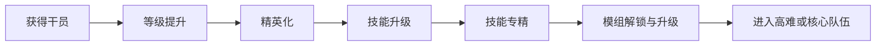
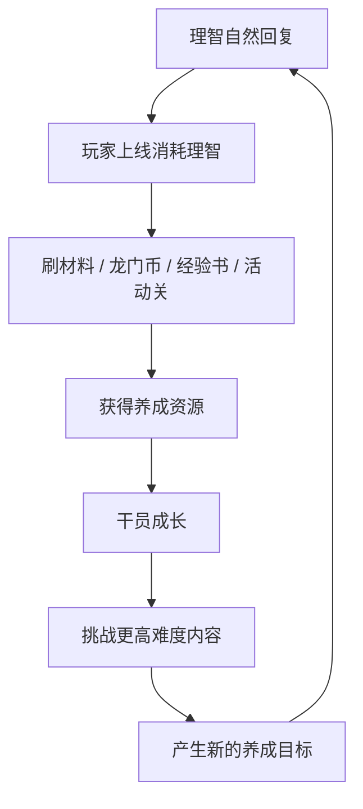
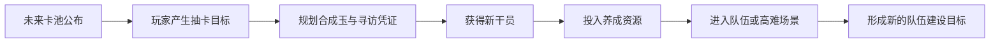
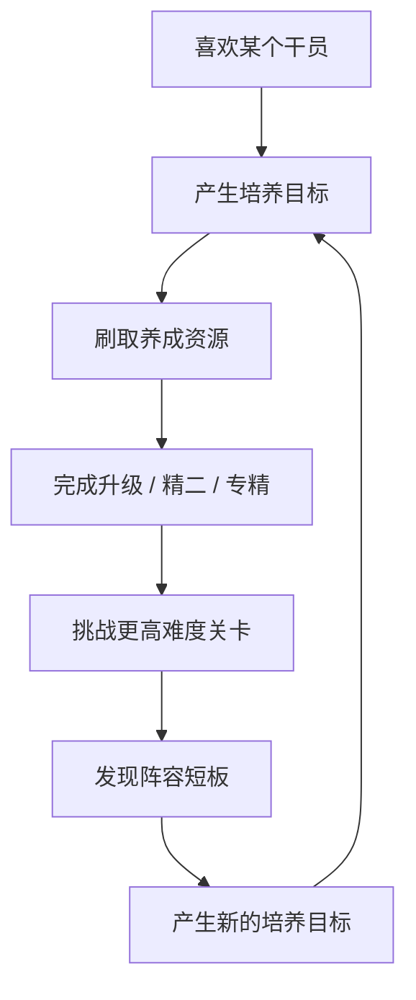

# 《明日方舟》干员养成与资源循环系统分析

## 项目概览

**作品类型：** 游戏系统分析 / 数值策划向作品  
**分析对象：** 《明日方舟》干员养成与资源循环系统  
**个人背景：** 《明日方舟》开服玩家，长期体验干员养成、活动商店、资源规划与版本节奏  
**目标岗位：** 数值策划实习生 / 系统策划实习生 / 游戏策划实习生  

## 核心观点

《明日方舟》的长期体验并不只来自塔防关卡本身，也来自“角色目标、资源限制、活动节奏、抽卡期待”共同组成的长期循环。

它让我印象最深的一点是：玩家并不是每天机械地上线清体力，而是在不断接近一个又一个目标。可能是把喜欢的干员精二，可能是把关键技能专三，可能是攒够下一次限定池，也可能是为高难关卡提前准备队伍。

因此，《明日方舟》的资源系统并不是单纯限制玩家，而是在让玩家的每一次选择变得更有重量。

---

## 一、为什么选择这个题目

作为《明日方舟》的开服玩家，我对这款游戏最深的感受，并不只是某一个角色、某一段剧情或者某一个关卡，而是它让我在很长时间里始终有一个“下一步目标”。

刚开始玩的时候，目标可能只是推过主线，练出一队能用的干员。后来目标慢慢变成精二喜欢的角色、专精核心技能、补齐不同职业、培养高难队伍，再到后期解锁模组、准备危机合约或高难活动。

这个过程不是一次性完成的，而是被资源、时间和版本节奏不断拉长。玩家经常会面对一些具体选择：先练谁，先精二谁，材料刷哪一关，活动商店先换什么，限定池前要不要攒抽。

这些问题看起来是玩家日常中的小决策，但从策划角度看，它们共同构成了《明日方舟》长期体验的重要部分。

### 策划角度小结

一个长期运营游戏想让玩家留下来，不能只依靠单次内容刺激，更需要让玩家持续产生“我还有下一步要做”的感觉。《明日方舟》的资源和养成系统，正是在不断制造这种长期目标感。

---

## 二、干员养成不是单点升级，而是一条长期成长链

《明日方舟》的干员养成并不是简单的“等级提升”。一个干员从获得到真正成型，通常要经历多个阶段：

这些系统共同构成了一条较长的成长链。玩家抽到一个喜欢的干员后，并不会马上获得完整强度，而是需要逐步投入资源，才能让角色真正进入队伍。

这种设计有两个重要作用。

第一，它延长了角色价值的释放过程。玩家不会在抽到角色的一瞬间就完成全部体验，而是在后续养成中不断获得反馈。每一次升级、精英化、专精，都像是角色向完整形态靠近了一步。

第二，它让玩家和角色之间产生更强的情感连接。一个干员如果只是抽到就结束，玩家的记忆可能停留在获得瞬间。但如果玩家为他刷材料、攒龙门币、反复查看技能专精需求，那么这个角色就会和玩家的投入绑定在一起。

这也是我作为玩家很有感触的一点。很多时候，我对某个干员的印象不只是“他很强”或“我喜欢他”，而是我清楚记得自己什么时候抽到他，什么时候给他精二，什么时候终于把技能专三。养成过程本身变成了玩家记忆的一部分。

### 策划角度小结

干员养成系统的意义不只是提升战力，而是把玩家对角色的喜欢转化为长期目标。角色越被投入资源，玩家与角色之间的连接越深。

---

## 三、资源有限，让选择变得有意义

《明日方舟》的资源系统有一个明显特点：资源长期处于“够用但不富余”的状态。

玩家每天可以自然回复理智，可以通过日常、周常、活动获得资源，但这些资源通常不足以让玩家同时培养所有想练的干员。于是玩家必须做选择。

想精二一个干员，就要准备龙门币、经验书、芯片和材料。  
想专精一个技能，就要投入更多高级材料。  
想培养新角色，就可能要推迟原本的养成计划。  
想攒抽，就要在当前卡池和未来卡池之间取舍。  

这种资源限制并不只是为了“卡玩家进度”，更重要的是让玩家的每一次投入都有重量。

如果所有资源都非常充足，玩家会很快完成养成，角色成长也会失去期待感。相反，如果资源过于紧缺，玩家又会感到疲惫和挫败。

《明日方舟》比较有意思的地方在于，它经常让玩家处在一种“差一点就够了”的状态。差一点龙门币，差几个材料，差一些理智，差一次活动商店兑换。这个“差一点”会推动玩家继续上线，也会让最终完成养成时的满足感更强。

### 策划角度小结

资源限制的核心价值不是让玩家痛苦，而是让玩家做出选择。好的资源系统应该让玩家感到“我需要规划”，而不是“我被系统强行卡住”。

---

## 四、理智系统控制了玩家的日常节奏

理智是《明日方舟》资源循环中非常核心的限制。玩家想要刷材料、刷经验、刷龙门币，都离不开理智。

理智系统的作用不只是限制游玩次数，它还在塑造玩家的日常节奏。玩家上线后会自然思考：今天的理智该怎么用？是刷活动图，还是刷材料本？是补芯片，还是刷龙门币？如果快溢出了，要不要先清掉？

这种设计让游戏形成了稳定的日常循环。玩家每天上线不一定都有新剧情或新活动，但理智的存在会让玩家始终有事可做。即使只是刷几关材料，也会让玩家觉得自己离某个养成目标更近了一点。

从数值策划角度看，理智系统承担了三个功能：

| 功能             | 具体作用                         |
| ---------------- | -------------------------------- |
| 控制资源产出速度 | 避免玩家短时间内完成过多养成     |
| 维持日常活跃     | 让玩家形成稳定上线习惯           |
| 强化资源选择     | 让不同关卡和不同资源之间产生取舍 |

### 策划角度小结

理智系统的价值不只是“限制玩家每天刷多少”，而是把玩家的日常行为组织进长期养成循环中。玩家每天消耗理智，本质上是在把时间投入转化为目标推进。

---

## 五、活动商店提供阶段性目标

日常刷图提供的是长期积累，而活动商店提供的是阶段性目标。

每次活动开放后，玩家除了体验剧情和关卡，通常也会关注活动商店：这次有哪些材料，哪些材料性价比高，要不要搬空商店，是否值得多刷活动图。

活动商店的作用不只是发放奖励，而是重新组织玩家在活动期间的行为。玩家会为了兑换高价值材料而刷活动关卡，也会根据商店内容调整自己的养成计划。

比如某次活动商店提供了大量高级材料，玩家可能会提前决定培养某个干员；如果商店中有寻访凭证或合成玉相关奖励，也会影响玩家对未来卡池的规划。

好的活动商店应该让玩家觉得“这次活动值得参与”，而不是单纯制造压力。奖励太低，玩家缺乏动力；奖励太高，又可能削弱日常关卡的价值。

我认为活动商店最理想的体验是：玩家觉得参加活动能够明显推进账号成长，但又不会产生“如果不搬空就亏了”的强迫感。

### 策划角度小结

活动商店连接了短期运营和长期养成。它既要提高活动期间的玩家活跃，也要避免破坏长期资源平衡。

---

## 六、抽卡资源连接了当前养成和未来期待

《明日方舟》的长期目标不只来自已有干员，也来自未来干员。

玩家在攒合成玉、寻访凭证时，实际上是在为未来版本做准备。一个新角色公布后，玩家会开始判断自己要不要抽、能不能抽、如果抽到了有没有资源培养。

这说明抽卡资源并不是独立系统，它和养成资源是连接在一起的。玩家抽到角色只是第一步，后续还需要投入大量资源才能真正使用这个角色。

从玩家心理看，抽卡资源规划带来的不是单纯的数字增长，而是一种“我正在接近目标”的感觉。稳定的资源投放、活动福利、周年或限定节点奖励，共同构成了玩家对未来版本的预期。

### 策划角度小结

抽卡系统提供期待，养成系统延长期待，资源系统控制期待实现的速度。三者共同构成了《明日方舟》长期运营体验中的重要闭环。

---

## 七、长期留存来自不断出现的新目标

我认为《明日方舟》的长期留存，很大程度上不是靠单一玩法维持的，而是靠目标链条维持的。

玩家喜欢一个干员，于是想培养他。  
培养他需要资源，于是去刷关卡。  
刷关卡需要理智，于是形成日常上线。  
活动开放后，玩家又获得新的资源目标。  
新角色公布后，玩家开始规划抽卡。  
高难关卡出现后，玩家又重新思考队伍搭配。  

这些目标之间不是孤立的，而是互相推动。角色提供情感动力，资源提供限制和选择，活动提供短期目标，卡池提供未来期待，关卡提供验证养成成果的场景。

### 策划角度小结

优秀的长期养成系统并不是让玩家永远“缺东西”，而是让玩家永远“有下一个想完成的目标”。

---

## 八、可能的优化思考

作为长期玩家，我能感受到《明日方舟》资源系统的深度，但也能理解新玩家面对复杂养成系统时的压力。

对于老玩家来说，查材料、算资源、规划养成已经成为习惯。但新玩家刚进入游戏时，可能会不知道应该优先培养哪些角色，也不知道材料应该从哪里获取，更不知道资源应该集中投入还是平均分配。

因此，我认为游戏内可以适当增加一些轻量化引导：

| 优化方向       | 具体思路                             | 预期作用               |
| -------------- | ------------------------------------ | ---------------------- |
| 新手期养成建议 | 根据主线进度提示优先培养一队核心干员 | 减少新玩家资源误投     |
| 材料来源提示   | 在干员养成界面显示主要获取途径       | 降低玩家查找成本       |
| 资源不足提示   | 缺少材料时给出推荐获取路径           | 提高养成流程顺畅度     |
| 活动商店推荐   | 增加新手推荐兑换标记                 | 帮助轻度玩家判断优先级 |
| 关键节点提示   | 对精英化、专精、模组等节点增加说明   | 帮助玩家理解成长阶段   |

这些优化不需要把游戏变成完全自动推荐，也不需要剥夺玩家研究系统的乐趣。它们更像是给新玩家一个进入系统深度的入口，让更多玩家能理解这套养成系统的魅力。

### 策划角度小结

系统深度和新手友好并不矛盾。真正理想的设计，是让核心玩家有研究空间，同时让新玩家有清晰入口。

---

## 九、总结：资源系统设计的是玩家的目标感

《明日方舟》的干员养成和资源循环系统，让我感受到数值策划并不是简单地控制材料数量，也不是冷冰冰地填写表格。它真正设计的是玩家的目标感、期待感、压力和满足感。

资源有限，才会让选择有意义。  
养成链条足够长，才会让角色陪伴感更强。  
活动商店提供阶段性目标，版本更新带来新的期待。  
抽卡资源连接未来，而日常理智推动玩家不断前进。  

作为一个开服玩家，我觉得《明日方舟》最打动我的地方之一，就是它让很多看似普通的日常行为都有了意义。刷一关材料、换一个商店奖励、攒一次抽卡资源，这些小动作最后都会汇聚成一种长期陪伴感。

好的资源系统不应该只是限制玩家，而应该让玩家觉得：

> 我今天做的每一次选择，都让我离想要的目标更近了一点。

---

## 可用于简历的项目描述

**《明日方舟》干员养成与资源循环系统分析｜个人策划作品**

- 结合《明日方舟》开服玩家经历，分析干员等级、精英化、技能专精、模组等成长链条如何形成长期养成目标。
- 从理智、龙门币、经验书、材料、芯片、活动商店和抽卡资源等角度，拆解游戏资源循环与玩家日常行为之间的关系。
- 总结资源限制、活动奖励、抽卡预期和长期目标感之间的联系，理解数值系统如何影响玩家留存。
- 提出新手养成建议、材料来源提示、活动商店推荐标记等优化方向，形成系统分析文档。
