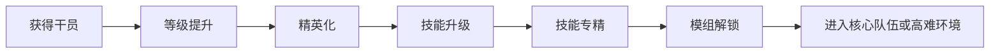
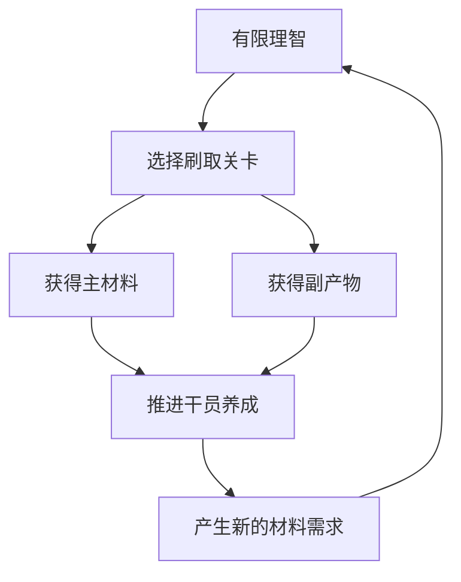
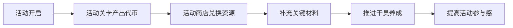
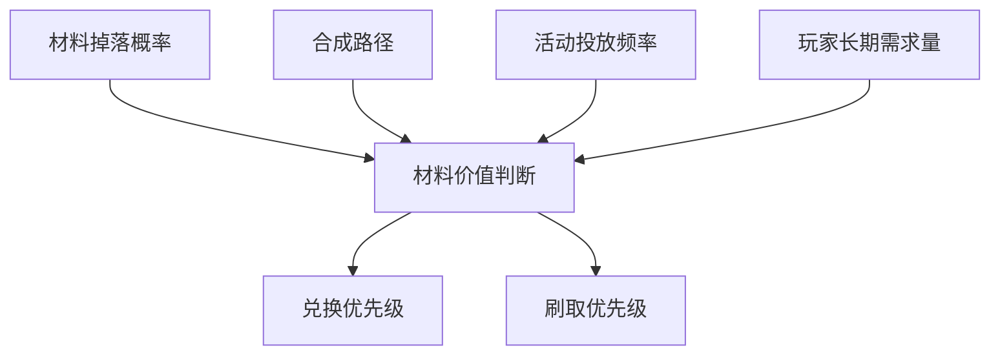
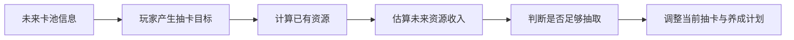
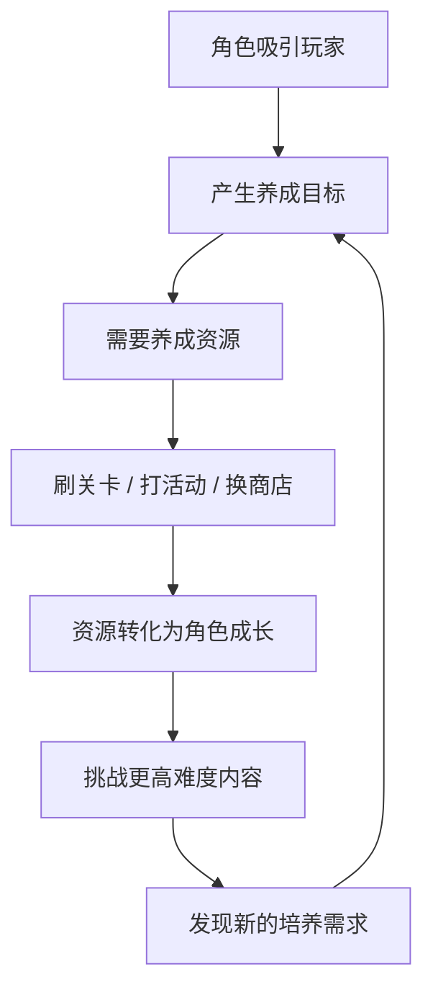

# 基于《明日方舟一图流》的玩家资源决策分析

## 项目概览

**作品类型：** 玩家工具分析 / 游戏系统分析 / 数值策划向作品  
**分析对象：** 《明日方舟一图流》工具站，以及其背后反映出的玩家资源规划需求  
**个人背景：** 《明日方舟》开服玩家，长期使用社区攻略、材料规划和抽卡规划工具  
**目标岗位：** 数值策划实习生 / 系统策划实习生 / 游戏策划实习生  

## 核心观点

《明日方舟一图流》表面上是一个玩家工具站，但它真正有价值的地方，不只是“告诉玩家刷什么、换什么、攒多少抽”，而是把《明日方舟》复杂的资源系统翻译成了玩家可以理解和执行的决策。

从玩家角度看，一图流解决的是资源焦虑：材料够不够、理智怎么用、活动商店先换什么、限定池前还能攒多少抽。  
从策划角度看，一图流反映的是《明日方舟》资源系统本身具有足够深度，玩家愿意投入时间去计算、规划和优化自己的成长路线。

---

## 一、为什么选择《明日方舟一图流》

作为《明日方舟》的开服玩家，我对这个游戏最深的体验之一，是它让我长期处在一种“我还有目标没完成”的状态。

有时候我上线不是为了体验新剧情，也不是为了挑战新关卡，而是因为某个干员还差几个材料，某个技能还差一点专精资源，或者下一个限定池快来了，我想知道自己还能攒多少抽。

在这样的长期游玩过程中，《明日方舟一图流》这类工具站就变得很自然。它不是一个单纯提供答案的网站，更像是玩家和游戏资源系统之间的“翻译器”。

玩家在游戏里感受到的是：

- 我缺材料，但不知道刷哪关更合适；
- 活动商店东西很多，但不知道先换什么；
- 材料种类太多，很难判断哪个更稀缺；
- 想抽未来卡池，但不知道现有资源够不够；
- 想培养新干员，但不知道整体资源压力有多大。

而一图流把这些模糊的问题变成了更清晰的功能：关卡推荐、商店性价比、物品价值、攒抽计算等。它帮助玩家从“凭感觉玩”逐渐过渡到“有计划地养成”。

### 策划角度小结

一个外部工具被大量玩家需要，往往说明游戏系统本身具有较高复杂度。工具站的价值不只是提供攻略，而是说明玩家已经开始把游戏中的资源、时间和目标当成一个可以规划的系统。

---

## 二、玩家为什么需要资源规划工具

《明日方舟》的养成系统并不是线性的。一个干员从获得到真正成型，通常会经历等级提升、精英化、技能升级、技能专精、模组解锁等多个阶段。每个阶段都需要不同资源，而且这些资源的获取方式、消耗速度和稀缺程度并不相同。

这就导致玩家并不是只需要“知道一个答案”，而是需要持续做判断。

例如，玩家抽到了一个新干员，接下来要考虑的不只是“要不要练”，还包括：

- 这个干员当前账号是否真的需要；
- 精二材料是否已经准备好；
- 龙门币和经验书是否足够；
- 技能是否值得专精；
- 专精优先级是否高于其他干员；
- 当前活动是否能补足关键材料；
- 如果现在培养他，会不会影响未来卡池资源规划。

这些问题本质上都是资源决策问题。一图流的存在，正是为了降低玩家做决策的成本。

### 策划角度小结

当一个游戏的资源系统足够复杂时，玩家自然会产生“最优解需求”。这并不一定是坏事，因为它说明游戏给了玩家足够多的选择空间。但如果游戏内信息表达不足，玩家就会转向外部工具。

---

## 三、关卡推荐：理智背后的效率问题

在《明日方舟》中，理智是日常资源循环的核心限制。玩家每天能够刷多少材料，本质上受到理智数量的约束。因此，刷哪一关并不是一个随意选择，而是一个效率问题。

一图流中的关卡推荐，表面上是在告诉玩家“缺这个材料去刷哪一关”。但它背后真正解决的是单位理智收益问题。

玩家关心的不只是某个材料能不能掉落，而是：

- 同样消耗理智，哪一关的综合收益更高；
- 主产物和副产物如何一起计算价值；
- 某个材料短期缺少，是否值得专门刷取；
- 日常关卡和活动关卡之间哪个更划算；
- 当前版本是否存在特别高收益的刷取地点。

这说明《明日方舟》的材料掉落并不是孤立系统，而是和玩家长期养成、日常活跃、活动节奏共同联系在一起。

### 策划角度小结

关卡推荐反映了玩家对“资源效率”的敏感。对于数值策划来说，关卡掉落设计不仅要考虑单个材料的掉率，也要考虑副产物价值、长期供需关系和玩家刷取体验。

---

## 四、活动商店：短期目标与版本资源投放

每次《明日方舟》活动开启后，玩家除了关注剧情、关卡和新角色，通常还会第一时间关注活动商店。

这次商店有哪些材料？  
有没有寻访凭证？  
高级材料值不值得优先换？  
要不要把商店搬空？  
刷活动图是否比刷日常图更划算？

这些问题说明，活动商店并不只是奖励列表，而是一次阶段性资源投放。它会直接影响玩家在活动期间的上线动力和养成计划。

一图流的商店性价比功能，实际上是在帮助玩家判断活动资源的优先级。对于重度玩家来说，它可以提高资源利用效率；对于轻度玩家或新玩家来说，它能减少“换错东西”的焦虑。

但从策划角度看，活动商店的平衡并不简单。奖励太低，玩家会觉得活动没有刷取价值；奖励太高，又可能削弱日常关卡和长期资源系统的稳定性。材料给得太分散，玩家感知不强；材料给得太集中，又可能让部分资源阶段性溢出。

### 策划角度小结

活动商店的核心不是单纯“送奖励”，而是通过限时资源投放制造阶段性目标。好的活动商店应该让玩家觉得活动值得参与，同时避免形成过强的强迫感。

---

## 五、物品价值表：复杂资源系统需要统一尺度

《明日方舟》的材料系统很复杂。不同材料之间存在等级差异、合成关系、掉落差异和需求差异。玩家表面上缺的是某个高级材料，但实际上消耗的往往是一整套低级材料、合成材料和刷取时间。

这就让玩家产生一个问题：不同材料之间到底谁更值钱？

物品价值表的意义就在于，它试图把不同材料放进一个相对统一的价值体系中，让玩家能够判断材料的真实稀缺程度和兑换优先级。

这对数值策划很有启发。材料价值不只取决于稀有度，也取决于实际消耗量、获取路径、活动投放、合成成本和玩家阶段需求。

如果某类材料长期缺口过大，玩家会感到疲惫；如果某类材料长期溢出，奖励又会失去吸引力。材料价值表的存在，说明玩家在长期体验中会主动感知资源结构的变化。

### 策划角度小结

资源价值不是静态的，而是由产出、消耗、替代关系和版本投放共同决定。数值策划需要关注的不只是单个材料，而是整个经济系统的供需平衡。

---

## 六、攒抽计算器：玩家对未来的期待管理

攒抽计算器是我认为很能体现玩家心理的功能。

它表面上是在计算合成玉、寻访凭证和未来抽数，但真正解决的是玩家对未来版本的不确定感。玩家攒抽的时候，并不是只在攒一个数字，而是在等待一个角色、一个限定池、一次自己期待的版本更新。

如果玩家不知道未来能攒多少抽，就容易产生焦虑；如果玩家能大致估算自己的资源情况，就更容易形成稳定预期。

这也说明抽卡资源并不是完全独立的系统。它会影响玩家当前是否抽卡、是否氪金、是否继续攒资源，也会影响玩家对下一个版本的期待。

从策划角度看，抽卡资源投放需要在期待感和压力之间保持平衡。资源太容易获得，抽卡目标会失去重量；资源过于紧张，玩家又会感到挫败。稳定的日常资源、活动福利和周年节点奖励，共同构成了玩家对未来版本的预期。

### 策划角度小结

攒抽计算器反映的是玩家对“未来目标”的管理需求。抽卡系统提供期待，而资源投放节奏决定玩家能否带着稳定预期继续留在游戏中。

---

## 七、从一图流反看《明日方舟》的长期养成设计

通过一图流可以看到，《明日方舟》的长期体验并不只来自战斗本身。玩家每天上线消耗理智、刷取材料、参与活动、积累抽卡资源，其实都在围绕长期目标前进。

这种设计的核心在于：玩家永远有想完成的目标，但这些目标不会立刻完成。

想练一个干员，就需要材料；  
想获得材料，就需要刷关卡；  
刷关卡需要理智，于是玩家开始规划日常；  
活动开放后，玩家根据商店奖励重新调整计划；  
新卡池公布后，玩家又开始计算抽卡资源。  

这些行为共同形成了一个完整的长期循环。玩家不是被单一玩法留住的，而是在角色、资源、活动、抽卡和社区讨论共同组成的系统里，不断找到新的目标。

### 策划角度小结

一图流之所以有价值，是因为《明日方舟》本身有一套能够被规划、被计算、被讨论的长期系统。玩家愿意使用工具，本质上是因为他们仍然在乎自己的账号成长和未来目标。

---

## 八、外部工具流行带来的优化思考

一图流的流行说明玩家愿意研究《明日方舟》的系统深度，但也说明游戏内部分信息表达仍然有优化空间。

对于老玩家来说，查材料、看掉率、算商店性价比已经成为日常，甚至会变成社区文化。但对于新玩家来说，这些内容可能会形成门槛。新玩家刚进入游戏时，面对大量干员、材料、关卡和养成路线，很容易不知道应该先做什么。

因此，我认为游戏内可以适当增加一些轻量化引导：

| 优化方向       | 具体思路                         | 预期作用               |
| -------------- | -------------------------------- | ---------------------- |
| 材料来源提示   | 在干员养成界面显示主要获取途径   | 降低查找成本           |
| 活动商店推荐   | 增加新手推荐兑换标记             | 帮助轻度玩家判断优先级 |
| 阶段性培养建议 | 根据主线进度提示培养一队核心干员 | 减少资源误投           |
| 资源不足引导   | 缺少材料时给出推荐获取路径       | 提高养成流程顺畅度     |
| 抽卡资源概览   | 提供更清晰的周期资源获取提示     | 降低玩家规划焦虑       |

这些优化并不需要替代外部工具，也不应该剥夺核心玩家研究最优解的乐趣。它们更像是给普通玩家一个入口，让更多玩家更容易理解资源系统的逻辑。

### 策划角度小结

系统深度和信息友好并不矛盾。好的设计应该让核心玩家有研究空间，同时让轻度玩家和新玩家不至于被复杂系统劝退。

---

## 九、总结：一图流记录的是玩家和资源系统的长期互动

《明日方舟一图流》表面上是一个玩家工具站，但它实际上记录了玩家和《明日方舟》资源系统之间的长期互动。

玩家在这里计算材料、规划理智、判断活动商店、估算未来抽数，本质上是在为自己的账号成长制定路线。

通过分析一图流，我更清楚地意识到，数值策划并不是冷冰冰地填写表格，而是在设计玩家的期待、压力和满足感。

好的资源系统不是让玩家感到被限制，而是让玩家觉得每一次规划都有意义。  
而《明日方舟》最打动我的地方，正是在于它让很多看似普通的日常资源，都变成了玩家长期陪伴游戏的一部分。

---

## 可用于简历的项目描述

**基于《明日方舟一图流》的玩家资源决策分析｜个人策划作品**

- 基于《明日方舟一图流》工具站，分析关卡推荐、商店性价比、物品价值表、攒抽计算器等功能背后的玩家资源规划需求。
- 从理智消耗、材料刷取、活动商店、抽卡资源和长期养成目标等角度，拆解玩家为什么需要外部工具辅助决策。
- 结合长期玩家体验，分析外部工具流行对游戏内信息表达、新手引导和资源系统设计的启发。
- 输出系统分析文档，用于展示游戏系统拆解、玩家需求理解和数值策划思维。
