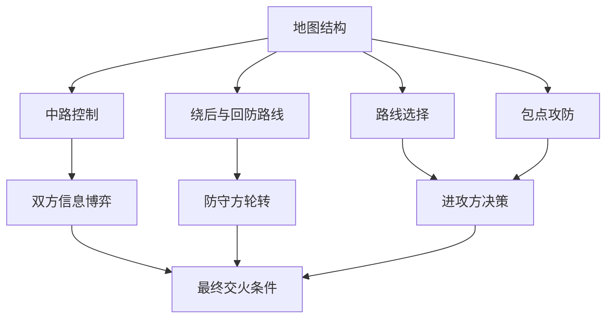
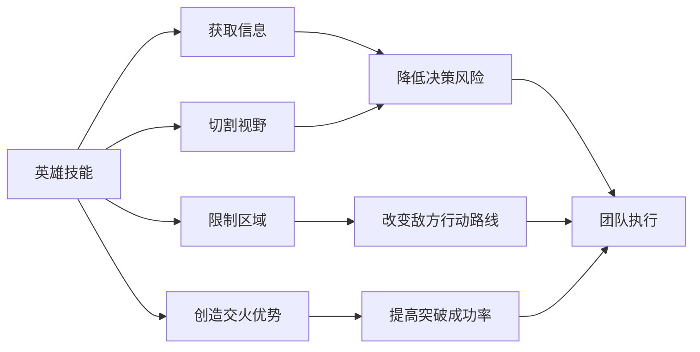
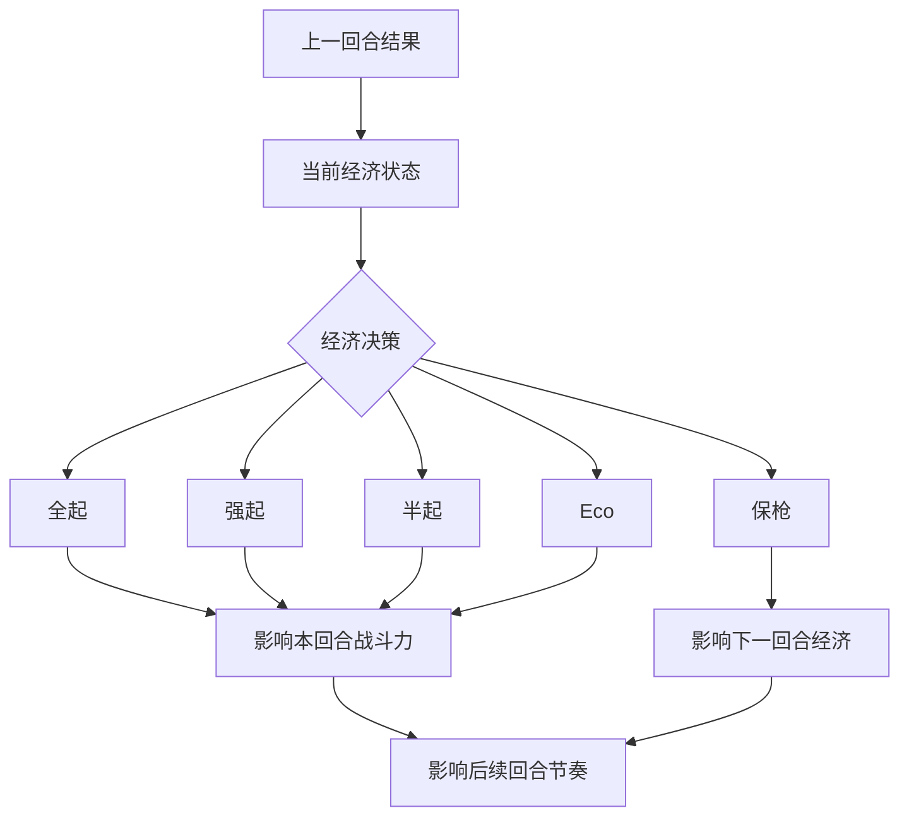
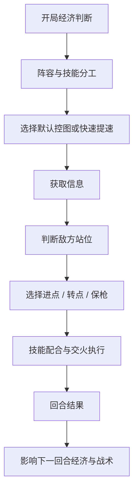

# 《无畏契约》竞技体验与技能平衡观察

## 项目概览

**作品类型：** 竞技游戏体验分析 / 战斗系统分析 / 游戏策划向作品  
**分析对象：** 《无畏契约》的地图攻防、英雄技能、经济系统、团队协作与平衡体验  
**个人背景：** 《无畏契约》累计游玩 600+ 小时，长期体验排位、不同地图、不同英雄定位与团队配合  
**目标岗位：** 游戏策划实习生 / 系统策划实习生 / 数值策划实习生  

## 核心观点

《无畏契约》的竞技体验并不只是“枪法好不好”，而是由地图结构、技能分工、经济系统、信息交换和团队执行共同构成。

枪法决定玩家能否赢下关键交火，但地图理解、技能释放、经济判断和团队沟通，决定了玩家能不能持续创造更好的交火条件。

从策划角度看，《无畏契约》的核心魅力在于：它让玩家每一回合都要在有限信息下做决策。玩家不是单纯比拼反应，而是在不断判断什么时候控图、什么时候转点、什么时候交技能、什么时候保枪、什么时候强起。

---

## 一、为什么选择《无畏契约》作为分析对象

《无畏契约》是我投入时间较多的一款竞技游戏，目前累计游玩 600+ 小时。相比单纯把它当作射击游戏，我更关注它在对局中如何通过地图结构、英雄技能、经济系统和团队协作，让玩家形成不同层次的决策。

在《无畏契约》中，枪法当然重要，但它并不是唯一决定胜负的因素。玩家需要判断什么时候控图、什么时候转点、什么时候保枪、什么时候强起，也需要根据阵容理解每个英雄在进攻和防守中的职责。

这也是我觉得它很适合作为策划分析对象的原因。它的系统设计并不是让技能完全替代枪法，也不是让射击体验完全独立存在，而是把技能、地图、经济和团队信息放进了同一个竞技框架中。

### 策划角度小结

一个优秀的竞技游戏，不能只让玩家比拼操作，还应该让玩家通过判断、配合和资源管理影响局势。《无畏契约》的深度，正来自操作和决策之间的结合。

---

## 二、地图攻防：空间结构决定玩家决策

《无畏契约》的地图并不是简单的“双方对枪场地”，而是通过包点、长通道、狭窄入口、中路控制区和绕后路线，迫使玩家不断做空间决策。

进攻方需要思考如何获取地图控制权。是直接爆弹进点，还是先控中路？是打默认慢摸，还是快速集合提速？这些选择会受到地图结构、敌方站位和己方技能组合的影响。

防守方则需要判断如何分配人数和资源。过度前压可能获得信息，但也容易被抓；过度龟缩虽然安全，但会让进攻方轻松获得地图控制权。

### 设计观察

一张好的竞技地图，应该让双方都有决策空间。进攻方不能总是无脑进点，防守方也不能永远固定站位。地图需要提供多种路线和信息博弈空间，让玩家每一局都能根据局势调整打法。

地图的价值不只是提供场景，而是通过空间结构影响玩家选择。

### 策划角度小结

地图设计的核心不是“路线多不多”，而是这些路线能否产生有效决策。好的地图应该让玩家在控图、转点、前压、回防之间不断权衡。

---

## 三、英雄技能：不是替代枪法，而是制造战术选择

《无畏契约》的技能设计很有特点。它不像传统 FPS 那样完全依赖枪法，也不像部分技能游戏那样让技能压过射击本身。它更像是把技能作为战术工具，用来创造对枪条件、获取信息、限制区域或改变节奏。

不同英雄定位承担不同职责：

| 英雄定位 | 核心职责                       | 对局作用         |
| -------- | ------------------------------ | ---------------- |
| 决斗位   | 突破、拉枪线、制造首杀机会     | 打开进攻缺口     |
| 烟位     | 切割视野、掩护进点或拖延进攻   | 改变交火环境     |
| 闪光位   | 创造突破时机、干扰敌方架枪     | 提高进点成功率   |
| 信息位   | 侦查敌方位置、降低决策不确定性 | 帮助队伍判断局势 |
| 哨位     | 防绕后、守点、延缓进攻         | 稳定防守结构     |

这说明技能的核心作用不是简单造成伤害，而是改变对局中的信息、空间和时间关系。

### 策划角度小结

《无畏契约》的技能不是为了让玩家“少打枪”，而是让玩家通过技能创造更合理的对枪条件。技能设计的价值，在于让玩家用策略改变交火环境。

---

## 四、经济系统：让每一回合都不只是单局胜负

《无畏契约》的经济系统让比赛不再是一个个独立回合，而是形成连续的回合博弈。

玩家输掉一回合后，并不只是进入下一回合重新开始，而是要判断经济情况：应该全甲长枪，还是半甲短枪？应该强起搏一波，还是 eco 攒钱？残局是否应该保枪？队友经济是否能够同步？

经济系统让玩家必须考虑长期收益，而不是只看眼前一回合。

比如强起成功可以直接打乱对方节奏，但失败会导致下一回合经济更差；保枪虽然放弃当前回合，但可以保留下一回合的战斗力。这些选择让玩家在对局中不断权衡风险和收益。

### 策划角度小结

经济系统的价值在于放大团队决策。它让每一回合的结果影响后续节奏，也让比赛产生更多逆转和博弈空间。

---

## 五、团队协作：信息交换决定执行质量

在《无畏契约》中，个人能力可以赢下某些交火，但长期胜率往往取决于团队协作。

有效沟通可以帮助队伍减少不确定性。比如防守方报点可以帮助队友判断敌方人数，进攻方沟通技能可以提高进点成功率，残局中信息共享可以帮助玩家选择更合理的站位和处理方式。

我认为《无畏契约》很重要的一点是，它把“信息”设计成了一种关键资源。

谁掌握更多信息，谁就能更早做出判断。信息位英雄、脚步声、技能反馈、小地图、队友报点，本质上都在影响玩家决策。

### 策划角度小结

竞技游戏的团队协作不只是“大家一起打”，而是信息、技能和站位之间的同步。信息流动越顺畅，团队执行质量越高。

---

## 六、技能平衡：强度不只看胜率，也要看体验

评价一个英雄是否平衡，不能只看胜率。胜率当然重要，但玩家体验同样重要。

有些技能即使胜率不一定最高，也可能让对手感觉缺少反制空间；有些英雄即使数据不夸张，也可能因为机制过于稳定而成为高分段常用选择。反过来，有些英雄可能在低分段表现一般，但在高水平团队配合中非常强。

### 平衡观察维度

| 观察维度   | 具体问题                   |
| ---------- | -------------------------- |
| 定位清晰度 | 这个英雄是否有明确职责     |
| 强势场景   | 他的优势是否集中在特定场景 |
| 反制空间   | 对手是否有合理应对方式     |
| 选择空间   | 他是否挤压同定位英雄出场   |
| 团队依赖   | 强度是否过度依赖配合       |
| 对抗体验   | 对手是否觉得不公平或无解   |

从策划角度看，竞技游戏平衡不是简单削弱强者、增强弱者，而是在保证不同角色特色的前提下，让玩家有合理选择空间。

### 策划角度小结

技能平衡不是只看数值强度，还要看机制是否健康。一个英雄可以强，但不能让对手觉得完全没有反制空间。

---

## 七、从玩家体验看竞技决策链条

《无畏契约》一回合中的决策并不是单一动作，而是一条连续链条。

这条链条说明，《无畏契约》的每一回合都不是孤立体验。玩家的经济判断会影响装备选择，装备选择会影响打法，打法会影响信息获取，信息会影响进攻路线，回合结果又会影响下一回合节奏。

这也是它耐玩的原因之一。即使地图和规则不变，每一局的经济状态、队友配合、敌方站位和技能使用都会改变玩家决策。

### 策划角度小结

好的竞技系统不是只提供固定规则，而是让同一套规则在不同局势下产生不同选择。玩家每一回合都能做出判断，系统才会有持续深度。

---

## 八、我从《无畏契约》中得到的策划理解

通过长期游玩《无畏契约》，我最大的感受是：竞技游戏的乐趣并不只是“赢”，而是玩家在高压力环境下不断做出判断。

什么时候进点，什么时候转点，什么时候交技能，什么时候保枪，什么时候前压拿信息，什么时候回防，这些决策共同构成了竞技游戏的深度。

《无畏契约》的系统设计把枪法、技能、地图、经济和团队协作结合在一起。玩家每一回合都不只是完成操作，而是在有限信息下进行判断和执行。

这对游戏策划很有启发。一个系统是否有深度，不只看规则复杂不复杂，而要看它能不能持续产生有意义的选择。

---

## 九、可能的优化观察

从长期玩家角度看，我认为竞技游戏在设计时需要持续关注几个体验问题：

| 方向         | 观察点                             | 可能影响     |
| ------------ | ---------------------------------- | ------------ |
| 地图学习成本 | 新玩家是否能理解主要路线和关键区域 | 影响入门体验 |
| 技能可读性   | 玩家是否能快速判断技能范围和效果   | 影响公平感   |
| 英雄定位差异 | 同定位英雄是否有明显区别           | 影响选择空间 |
| 经济反馈     | 玩家是否理解当前经济状态和风险     | 影响团队决策 |
| 沟通成本     | 游戏是否鼓励有效信息交换           | 影响团队体验 |

这些问题不一定代表当前设计存在明显缺陷，而是竞技游戏在长期运营中需要持续观察的方向。

### 策划角度小结

竞技游戏的优化不能只盯着强度表，也要关注玩家是否能理解系统、是否有反制手段、是否能通过学习获得成长。

---

## 十、总结

《无畏契约》让我理解到，竞技游戏的平衡和体验并不是孤立存在的。

地图决定玩家的空间选择；  
技能改变交火条件；  
经济系统影响连续回合节奏；  
团队沟通决定执行质量；  
平衡设计影响玩家的选择空间和对抗体验。  

对于策划来说，设计一个竞技系统不是简单地让每个角色数值接近，而是要让不同角色、不同地图、不同局势下都存在合理选择。

我认为好的竞技体验应该具备三个特点：

第一，玩家能通过操作获得成就感；  
第二，玩家能通过决策影响局势；  
第三，玩家能通过团队协作放大个人价值。  

这也是我希望在游戏策划岗位中继续学习的方向：不只关注玩法表面，而是理解系统如何影响玩家选择、情绪和长期体验。

---

## 可用于简历的项目描述

**《无畏契约》竞技体验与技能平衡观察｜个人策划作品**

- 基于 600+ 小时游玩经验，从地图攻防、英雄技能、经济系统、团队协作和技能平衡等角度分析竞技游戏体验。
- 拆解《无畏契约》中地图结构、技能定位、经济决策和信息交换如何共同影响玩家回合决策。
- 总结竞技游戏平衡不能只看胜率，也需要关注反制空间、角色定位、团队依赖和对抗体验。
- 输出系统分析文档，用于展示竞技游戏理解、玩家体验分析和策划表达能力。
